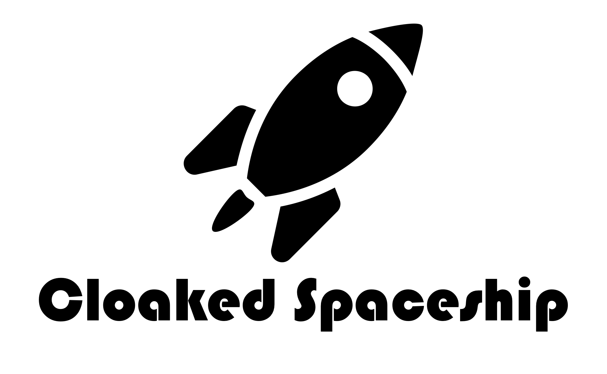
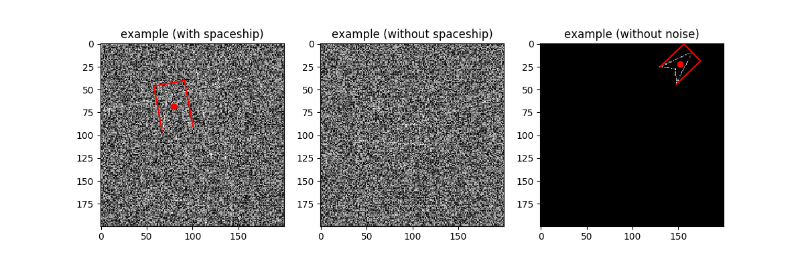

<p align="center">
  <a href="https://github.com/destin-v">
    
  </a>
</p>

# 📒 Description
<p align="center">
  
</p>

<p align="center">
  <a href="https://devguide.python.org/versions/">              </a>
  <a href="https://docs.github.com/en/actions/quickstart">      </a>
  <a href="https://black.readthedocs.io/en/stable/index.html">  </a>
</p>

<p align="center">
  <a href="https://github.com/destin-v/cloaked_spaceship/actions/workflows/pre-commit.yml">  </a>
  <a href="https://github.com/destin-v/cloaked_spaceship/actions/workflows/pytest.yml">      </a>
</p>

This was an interesting computer vision problem I completed back in 2021.  It requires building an AI solution to pick out an object from a noisy environment.  I created a novel implementation that was able to train on limited GPU resources.  This code is designed to showcase how to train small models for a difficult problem.  The small models can be stitched together in a ***hydra*** configuration to provide accurate inferences on many different tasks.

# 🚀 Decloaking Spaceship Challenge

## Installation
```console
poetry install --with=dev
```

**Requirements:**
Python==3.8 is needed in order to install the packages stated in the requirements.txt.

## Problem

<figure>
    <p align="center">
    
    </p>
</figure>

<p align="center">
<b>Fig 1: The spaceship is cloaked inside a noisey environment.</b>
</p>

The goal is to detect spaceships which have been fitted with a cloaking device that makes them less visible. You are expected to use a deep learning model to complete this task. The model will take a single channel image as input and detects the spaceship (if it exists). Not all image will contain a spaceship, but they will contain no more than 1. For any spaceship, the model should predict their bounding box and heading. This can be described using five parameters:

* $x$ and $y$ position (centre of the bounding box)
* Yaw (direction of heading)
* Width (size tangential to the direction of yaw)
* Height (size along the direct of yaw)

We have supplied a base model as a reference which performs poorly and has some serious limitations. You can extend the existing model or reimplement from scratch in any framework of your choice.

The metric for the model is AP at an IOU threshold of 0.7, for at least 1000 random samples, with the default generation parameters (see `main.py`). Please do not modify any of the generation code directly.

## Evaluation Criteria
* Model metric, score as high as you can while being under 2 million trainable parameters. Please streamline the parameters where possible
* Model architecture
* Loss function
* Code readability and maintainability, please follow general python conventions

## Deliverables
1. Report a final score
2. A summary of the model architecture. E.g. `model.summary()` or `torchsummary`
3. A `train.py` script that allows the same model to be reproduced
4. The final model weights
5. A `requirements.txt` file that includes all python dependencies and their versions
6. A `main.py` file that reproduces the reported score


## Tips
* Carefully consider how the loss function should be formulated (especially yaw)
* Sanity check how trainable parameters are distributed in the network
* You may use as many training examples as you want. Both train and test used the same generation function
* You may use existing a codebase but please reference the source
* Submitted solutions achieve 0.5 score on average, but it is possible to achieve near perfect score.
* Any pre/post-processing that can be reproduced at inference is fair game.

# 😎 Solution

For the spaceship problem I actually created four separate neural network models and assigned them each a different task.  The reason I did this is because I saw that the parameters that had to be estimated were all different and certain estimations were more important than others (i.e. $x$, $y$ position mattered more than height and width).

So I first created a base model that could estimate $x$, $y$, $height$, and $width$.  Once I had a base model that could accurately predict those estimations, I applied transfer learning to build four separate models that performed the following estimations:

1. **detection_model:** predicts whether a spaceship exists in the image (1 or -1)
2. **position_model:** predicts ($x$, $y$) of the spaceship
3. **area_model:** predicts ($height$, $width$) of the spaceship
4. **angle_model:** predicts the angle of the spaceship

Each of these models were around 260,000 total parameters.  So even though four different models were used, they still satisfied the condition of being under two million learnable parameters.  With all four models my total learnable parameters was slightly above 1 million.  This made it easier for me to train the models on my laptop where computing resources are limited.  The other advantage of this method is that it allowed each model to overfit to their desired target values.  All four variants were just a derivation of the ***Base Model*** with a few changes to the output head.


Base Model Architecture:
---
| Layer (type)               | Output Shape                  | Param # |
| -------------------------- | ----------------------------- | ------- |
| reshape (Reshape)          | (None, 200, 200, 1)           | 0       |
| conv2d (Conv2D)            | (None, 200, 200, 16)          | 160     |
| batch_normalization        | (BatchNo (None, 200, 200, 16) | 64      |
| activation (Activation)    | (None, 200, 200, 16)          | 0       |
| conv2d_1 (Conv2D)          | (None, 100, 100, 16)          | 2320    |
| batch_normalization_1      | (Batch (None, 100, 100, 16)   | 64      |
| activation_1 (Activation)  | (None, 100, 100, 16)          | 0       |
| conv2d_2 (Conv2D)          | (None, 100, 100, 16)          | 2320    |
| batch_normalization_2      | (Batch (None, 100, 100, 16)   | 64      |
| activation_2 (Activation)  | (None, 100, 100, 16)          | 0       |
| conv2d_3 (Conv2D)          | (None, 50, 50, 16)            | 2320    |
| batch_normalization_3      | (Batch (None, 50, 50, 16)     | 64      |
| activation_3 (Activation)  | (None, 50, 50, 16)            | 0       |
| conv2d_4 (Conv2D)          | (None, 50, 50, 32)            | 4640    |
| batch_normalization_4      | (Batch (None, 50, 50, 32)     | 128     |
| activation_4 (Activation)  | (None, 50, 50, 32)            | 0       |
| conv2d_5 (Conv2D)          | (None, 25, 25, 32)            | 9248    |
| batch_normalization_5      | (Batch (None, 25, 25, 32)     | 128     |
| activation_5 (Activation)  | (None, 25, 25, 32)            | 0       |
| conv2d_6 (Conv2D)          | (None, 25, 25, 32)            | 9248    |
| batch_normalization_6      | (Batch (None, 25, 25, 32)     | 128     |
| activation_6 (Activation)  | (None, 25, 25, 32)            | 0       |
| conv2d_7 (Conv2D)          | (None, 13, 13, 32)            | 9248    |
| batch_normalization_7      | (Batch (None, 13, 13, 32)     | 128     |
| activation_7 (Activation)  | (None, 13, 13, 32)            | 0       |
| conv2d_8 (Conv2D)          | (None, 13, 13, 48)            | 13872   |
| batch_normalization_8      | (Batch (None, 13, 13, 48)     | 192     |
| activation_8 (Activation)  | (None, 13, 13, 48)            | 0       |
| conv2d_9 (Conv2D)          | (None, 7, 7, 48)              | 20784   |
| batch_normalization_9      | (Batch (None, 7, 7, 48)       | 192     |
| activation_9 (Activation)  | (None, 7, 7, 48)              | 0       |
| conv2d_10 (Conv2D)         | (None, 7, 7, 48)              | 20784   |
| batch_normalization_10     | (Batc (None, 7, 7, 48)        | 192     |
| activation_10 (Activation) | (None, 7, 7, 48)              | 0       |
| conv2d_11 (Conv2D)         | (None, 4, 4, 48)              | 20784   |
| batch_normalization_11     | (Batc (None, 4, 4, 48)        | 192     |
| activation_11 (Activation) | (None, 4, 4, 48)              | 0       |
| conv2d_12 (Conv2D)         | (None, 4, 4, 64)              | 27712   |
| batch_normalization_12     | (Batc (None, 4, 4, 64)        | 256     |
| activation_12 (Activation) | (None, 4, 4, 64)              | 0       |
| conv2d_13 (Conv2D)         | (None, 2, 2, 64)              | 36928   |
| batch_normalization_13     | (Batc (None, 2, 2, 64)        | 256     |
| activation_13 (Activation) | (None, 2, 2, 64)              | 0       |
| conv2d_14 (Conv2D)         | (None, 2, 2, 64)              | 36928   |
| batch_normalization_14     | (Batc (None, 2, 2, 64)        | 256     |
| activation_14 (Activation) | (None, 2, 2, 64)              | 0       |
| conv2d_15 (Conv2D)         | (None, 1, 1, 64)              | 36928   |
| batch_normalization_15     | (Batc (None, 1, 1, 64)        | 256     |
| activation_15 (Activation) | (None, 1, 1, 64)              | 0       |
| flatten (Flatten)          | (None, 64)                    | 0       |
| dense (Dense)              | (None, 25)                    | 1625    |
| batch_normalization_16     | (Batc (None, 25)              | 100     |
| activation_16 (Activation) | (None, 25)                    | 0       |
| dense_1 (Dense)            | (None, 4)                     | 104     |

Condensed Metrics
---
| Parameters           | Value    |
| -------------------- | -------- |
| Total params         | 258,613  |
| Trainable params     | 257,283  |
| Non-trainable params | 1,330    |
| Final Score          | **~63%** |


# 🧭 Website

```console
nox -r -s autodoc
```
